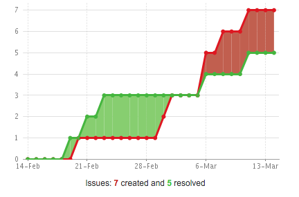

# Software Architecture 2015/2016

:computer: *Faculdade de Ciências da Universidade do Porto* :computer:

### Group Elements
- Tiago Martins
- Raul Ferreira
- Paula Giesta
- Dinis Costa
- Saúl Costa

### Development

There are several components that form **MusicBrainz** and that are necessary for its functioning: the **MusicBrainz Server**, **MusicBrainz Database**, **web service** and related **client libraries**, and applications/services. 

The [MusicBrainz Server] (https://musicbrainz.org/doc/MusicBrainz_Server) is written in Perl and is an open source software application that provides the primary interface to the [MusicBrainz Database] (https://musicbrainz.org/doc/MusicBrainz_Database).

Users can browse and edit the data on the website, and the web service power client applications like [MusicBrainz Picard] (http://picard.musicbrainz.org).

The MusicBrainz Database contains all the music metadata (that includes information about artists, recordings, releases, works and labels), and is built on the PostgreSQL relational database engine. The full history of all the changes that the MusicBrainz community has made is also stored in this database. 

The development of [Picard](http://picard.musicbrainz.org) started in 2003, and the development of its recent structure started in 2007.

The developer community is mostly situated in North America and Europe.

### Issues

This Project does not use the Github [Issues](https://github.com/features#issues) functionality, instead Musicbrainz uses it's own [bug tracker](http://tickets.musicbrainz.org/) which uses the software [JIRA Software](https://www.atlassian.com/software/jira)

