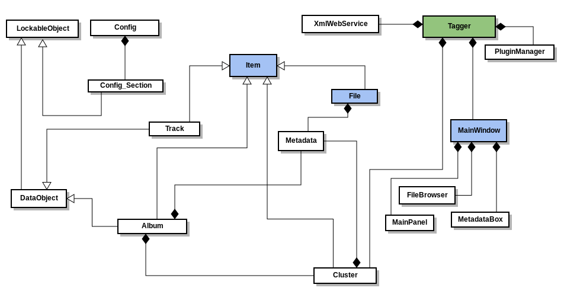
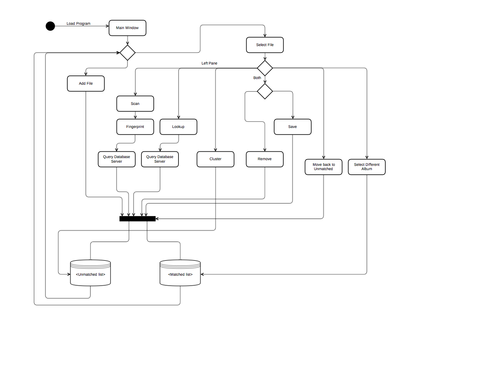

# Software Architecture 2015/2016

:computer: *Faculdade de Ciências da Universidade do Porto* :computer:

### Group Elements

-   Dinis Costa
-   Paula Giesta
-   Raul Ferreira
-   Tiago Martins
-   Saúl Costa

#### Logical View

After analysing the project structure, we have chosen to represent the Logical view using a class diagram.
Given the project complexity, we chose not to show all classes and to consider the most important only.

The project has a main class "Tagger" which is composed by the following classes:
- **PluginManager**, which manages the plugins installed on the system.
- **XmlWebService**, which is responsible for linking to the "Metabrainz" server.
- **MainWindow**, which manages the graphical interface, and is composed by the classes:
  - **FileBrowser**, that allows to work with local files / browse the file system,
  - **MetadataBox**, that is responsible for presenting the detailed information of each file, also allowing user input to change the metadata,
  - **MainPanel**, which corresponds to the main display area and program interaction.

- **Cluster**, that allows to group the files into clusters (e.g. arrange tracks into albums).

The "Item" class is a generalization of the classes "Cluster", "Album", "File" and "Track".
The "File" class is composed by "Metadata", as well as the "Album" class, which is also composed by "Cluster".
The "DataObject" class is a generalization of "Album" and "Track".
The "LockableObject" is a generalization of the "DataObject" and "Config.Section", which in turn is composed by "Config" (that sets the configurations, e.g. sets current profile and upgrade configuration version to the latest).

#### Proccess View

When the program starts, the user is shown a dual-pane window, one being the visual representation of the Unmatched List and the other the visual representation of the Matched List.
At that point the user can perform actions that only change the Matched list, the Unmatched List or both.

If the user simply adds more files(which he can do in a variety of different ways, but those differences are not really relevant for the control flow of the program), the program will automatically add those files to the correct list, and will move back to it's initial state waiting for more actions from the user.

If, on the other hand, the user selects a file(or multiple files) then are many different actions/outcomes that can come out of that. !!!(FIX WEIRD PHRASING)!!!

Although some of the available actions are specific to each of the panes, some actions are available for both panes, them being **Remove** and **Save**. Those will obivously make the program make sure that both lists are in a consistent state. !!!(Yes, No, Maybe)!!!

After selecting files on right pane, the available actions are:

- **select a different album**: in case the user wants to change some files, for which a match was found, to a different release of a particular album or to a totally different album altogether.

- **move back to the Unmatched List**: in case the user wants to start over, because some part of the proccess went totally wrong !!!(LOLWUT??)!!!
