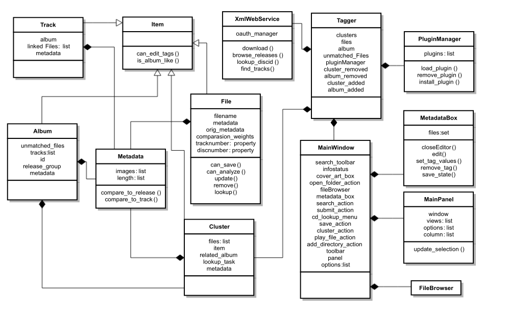
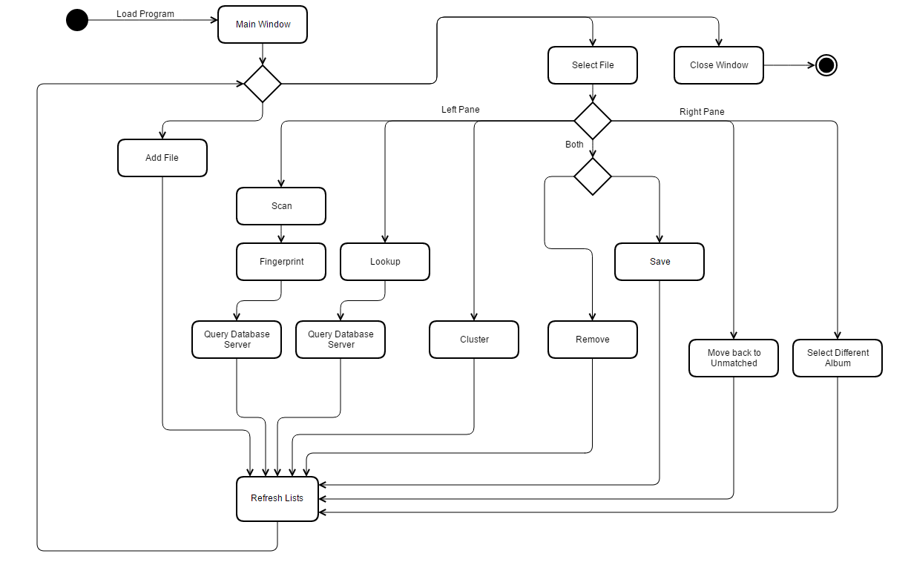
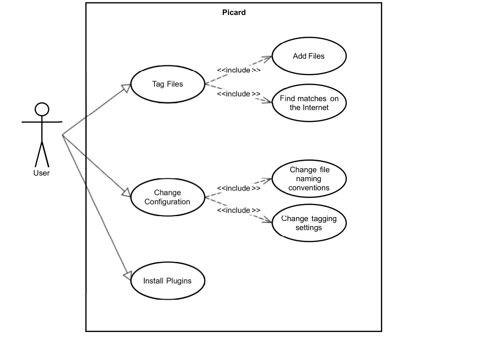

# Software Architecture 2015/2016

:computer: *Faculdade de Ciências da Universidade do Porto* :computer:

### Group Elements

-   Dinis Costa
-   Paula Giesta
-   Raul Ferreira
-   Tiago Martins
-   Saúl Costa

--

In order to represent the organization of this project, we created 5 UML diagrams for each of the 5 views of the 4 + 1 architectural view model.

### The 4 + 1 architectural view model

+ **Logical view** : represented by a class or package diagram; shows the key abstractions of the system, traditionally in the form of classes, objects or packages. 

+ **Development (implementation) view** : represented by a component diagram; shows the main software components and their interactions.

+ **Physical (deployment) view** : represented by a deployment diagram; it is intended to represent the system through the interaction of software components with the system hardware.

+ **Process view** : represented by an activity diagram; shows the various system processes and their run-time interactions.

+ **Use case view** : represented by a use case diagram; is responsible for the connection between all other 4 views  and represents some of the actions that the actors are allowed to do in the software.

#### Logical View

After analyzing the project structure, we have chosen to represent the Logical View using a class diagram.
Given the project's complexity, we decided to represent only the most importante classes, and for each of them only the most important properties/methods.

The project has a main class **Tagger** which is composed by the following classes:

- **PluginManager**, which manages the plugins installed on the system.
- **XmlWebService**, which is responsible for making a connection to the _Metabrainz_ server with a specific user login(**note** that only a few of the app's extra functionalities require this). It is also responsible for the download of the metadata and album lookup functionality.
- **MainWindow**, which manages the graphical interface, and is composed by the classes:
  - **FileBrowser**, that allows to work with local files / browse the file system,
  - **MetadataBox**, that is responsible for presenting the detailed information of each file, also allowing user input to change the metadata,
  - **MainPanel**, which corresponds to the main display area and program interaction.

Other classes include:

- The **Cluster** class, which is responsible for the logical representation of groups of files that the user creates within the program (i.e. arrange tracks into albums).

- The **File** class, which deals with information asssociated which each file. Some of it utilizes the structure defined in the **Metadata** class(e.g. _orig_metadata_ and _metadata_) while other properties, like _filename_ and _comparasion_weights_ are self defined.

- The **Track** class, which stores the list of files that match against a particular track in an album. It also stores the metadata.

- The **Album** class, which represents the albums, whose information was downloaded from the _MetaBrainz_ server, by storing their tracklist and also which files the program user is still missing in order to "complete" the album.

- The **Item** class, which is a generalization of the classes **Cluster**, **Album**, **File** and **Track**. It forces all those classes to represent whether or not the object they refere to can be edited and whether it is an album or not.

#### Process View

When the program starts, the user is shown a dual-pane window, one being the visual representation of the Unmatched List and the other the visual representation of the Matched List.
At that point the user can perform different actions, which include adding files, selecting previously added files or closing the program.

If the user simply adds more files (which he can do in a variety of different ways, but those differences are not really relevant for the control flow of the program), the program will automatically add those files to the correct list, files that haven't been tagged before go to the unmatched files list and files that have already been tagged to the matched list.

If, on the other hand, the user selects a file (or multiple files), the program will make different actions available, each of which will lead to a different path in the proccess view.

Although some of the available actions are specific to each of the panes, some actions are available for both panes, them being **Remove** and **Save**.

When the user selects files on the right pane, the available actions are:

- **Select a different album**: in case the user wants to change some files, for which a match was found, to a different release of a particular album or to a totally different album altogether.
- **Move back to the Unmatched List**: in case the user wants to start over the tagging proccess

When the user selects files on the left pane, the available actions are:

- **Scan**: the program will use [AcoustID](https://acoustid.org/) to generate audio fingerprints, and try to check them against the MusicBrainz database.
- **Lookup**: the program will do an [indexed search](https://musicbrainz.org/doc/Search#Indexed_search) on the MusicBrainz database and will return an album match if it finds a result with a score above what was defined in the program settings. 
- **Cluster**: the program will create different folders inside the "Cluster" folder with the name that the files from the unmatched list are stored on the users system and will move all the possible files to the specific folders.

#### Development View

According to our analysis of the project, Picard has 6 key components: **Picard** (the main component), **Qt**, **Picard Ui**, **Plugins**, **Util** and **FileBrowser**.

**Picard UI** component is responsible for the main interaction between user and software and implements a graphical user interface prototype, with which, user can perform various operations. 
This prototype is then implemented by the Graphical user interfaces library **Qt**.

The **Util** component contains common features to several software components and commonly used data structures.

**Plugins** is the component responsible for adding specific features to Picard and **File browser** allows Picard to manage files and folders.

#### Physical view 

Picard runs on a single computer and is a cross-platform application (it's available for Windows, Linux and OS X).

The application just requires **music files** that are loaded by the user, supporting various different formats.

#### Use Cases

After the user installs and opens Picard, there are several possible actions that can be performed. However, our Use Cases diagram only represents the three main activities, one of them being the purpose of Picard, tagging and organizing music files, which can be done by adding files and finding matches on the Internet.
The user can also modify several configurations, for example, the file naming convention and the tagging settings. It can also install plugins, some of them being *Feat. Artists Removed* that removes feat. artists from track titles, *Release Type* that appends information to EPs and Singles and *Last.fm*  that uses tags from Last.fm as genre.

